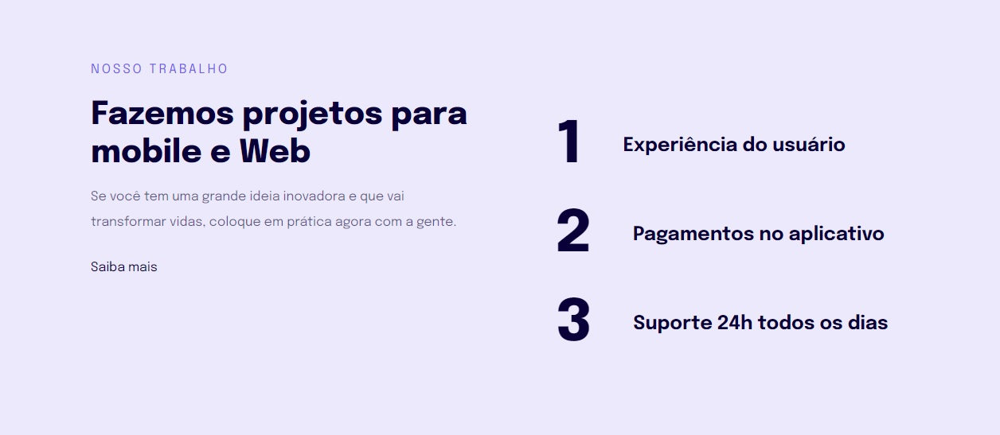

<h1 align="center"> Página Responsiva </h1>

Projeto de introdução a responsividade desenvolvido no programa Explorer da Rocketseat.  

  

  

 <h2 align="center"><a href="https://isadoraguiar.github.io/explorer-course/stage-03/responsive-page" target="_blank" >Projeto ao vivo</a></h2>

### 🚀 Tecnologias

Esse projeto foi desenvolvido com as seguintes tecnologias:

- HTML e CSS
- Git e Github
- Figma

### :memo: Licença

Esse projeto está sob a licença MIT.

---

Feito com ♥ por Isadora Aguiar :wave:
