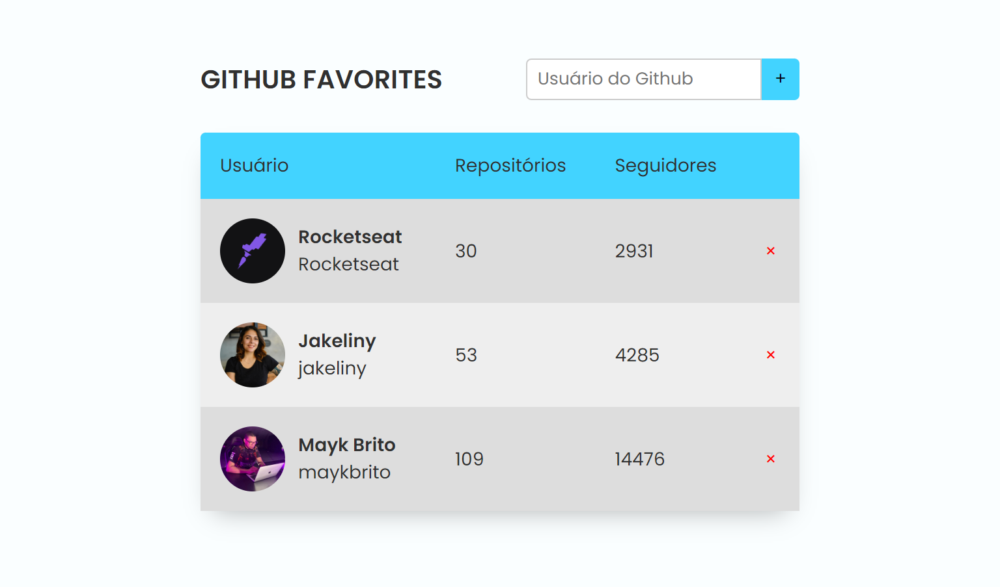

<h1 align="center"> Github Favorites </h1>

Neste aplicativo é possível adicionar usuários do Github em sua lista de favoritos, a aplicação utiliza a própria API do Github.  

  

  

 <h2 align="center"><a href="https://isadoraguiar.github.io/explorer-course/stage-06/git-favorites" target="_blank">Projeto ao vivo</a></h2>

### 🚀 Tecnologias

Esse projeto foi desenvolvido com as seguintes tecnologias:

- HTML e CSS
- Javascript
- Git e Github
- Figma

### :memo: Licença

Esse projeto está sob a licença MIT.

---

Feito com ♥ por Isadora Aguiar :wave:
