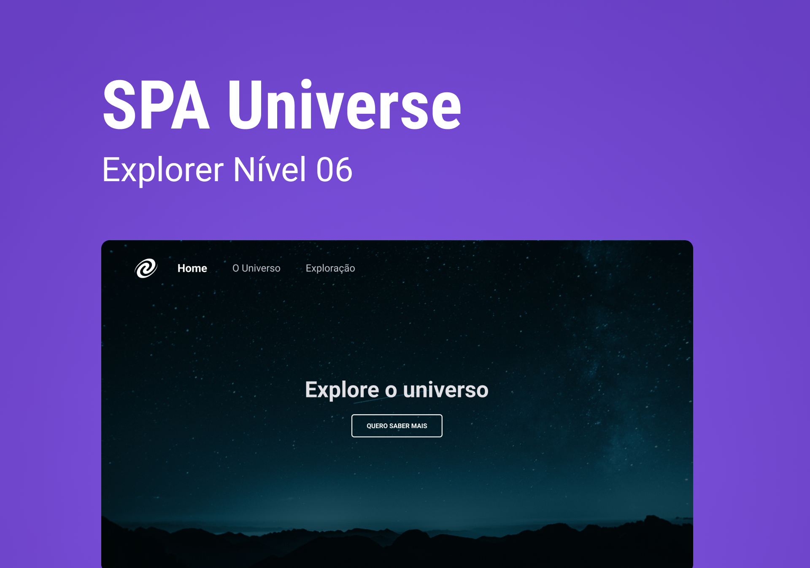

<h1 align="center"> SPA Universe </h1>

Neste projeto foi criada uma SPA (Single-Page Application), que é um tipo de aplicação web onde as funcionalidades estão concentradas em uma única página, o que permite que o usuário navegue pelas diferentes seções sem recarregar toda a página.  

  

  

 <h2 align="center"><a href="https://spa-universe-rocket.vercel.app/" target="_blank">Projeto ao vivo</a></h2>

### 🚀 Tecnologias

Esse projeto foi desenvolvido com as seguintes tecnologias:

- HTML e CSS
- Javascript
- Git e Github
- Figma

### :memo: Licença

Esse projeto está sob a licença MIT.

---

Feito com ♥ por Isadora Aguiar :wave:
